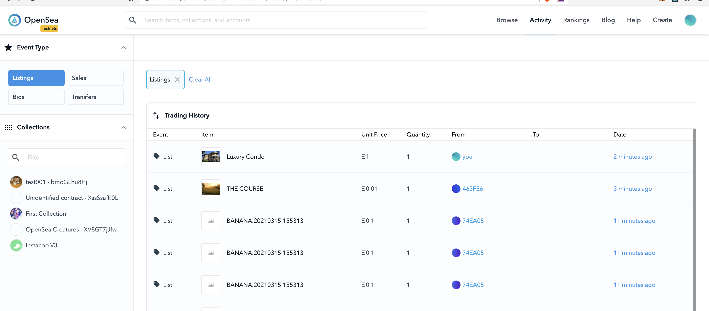
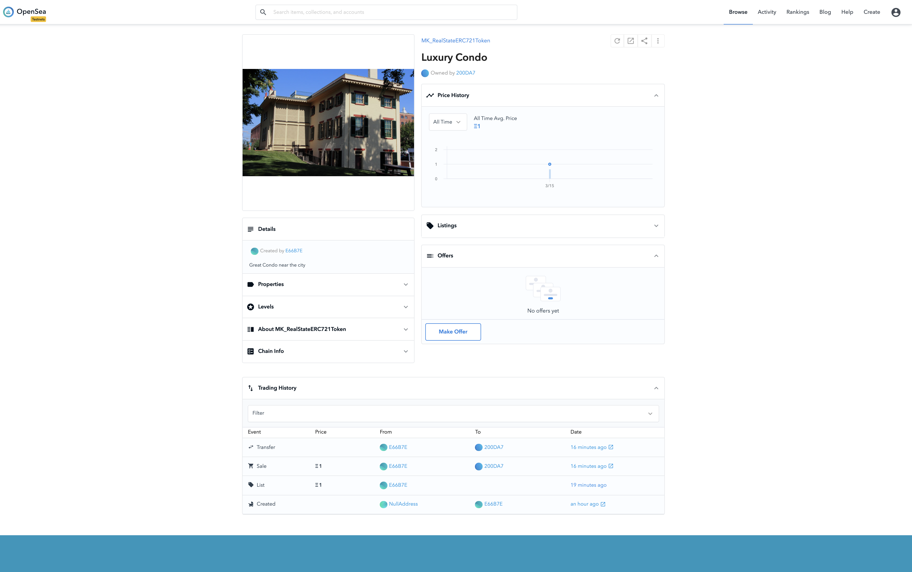
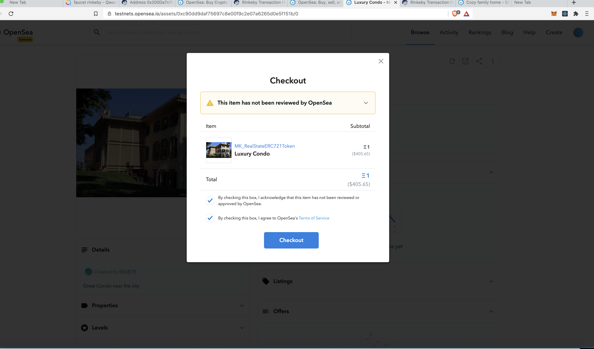

# Udacity Blockchain Capstone

The capstone will build upon the knowledge you have gained in the course in order to build a decentralized housing product. 

## Versions 

- Truffle v5.1.61 
- Solidity - 0.6.12 
- Node v15.5.1
- Web3.js v1.2.9
- Ganache v1.2.3
- zokrates/zokrates:0.4.7

## Contract addresses on rinkeby test network and ABI
#### Verifier 
```
   > transaction hash:    0xe2046f54701c067af6b8894d3d6a7bc3aaecb95838b376bec308cdaef5fc811a
   > Blocks: 0            Seconds: 9
   > contract address:    0x6ef5d942Cce6CfEAcFB67FDFFFd83d3Bd02fCDd6
   > block number:        8239208
   > block timestamp:     1615821292
   > account:             0xE66B7E039a9712fBA81D56fFCFd715C741b753b7
   > balance:             34.075794352000000001
   > gas used:            976302 (0xee5ae)
   > gas price:           10 gwei
   > value sent:          0 ETH
   > total cost:          0.00976302 ETH

```

#### SolnSquareVerifier ("MK_RealStateERC721Token", "MK_RS721")
```
   > transaction hash:    0x45fb067294c8e1583da1dd5fe09c7b892f32ad318a70f86df1f6a2bc48e55a71
   > Blocks: 1            Seconds: 13
   > contract address:    0xc90Dd9DaF75697C8e00f9c2e07a6265D0E5f151b
   > block number:        8239209
   > block timestamp:     1615821307
   > account:             0xE66B7E039a9712fBA81D56fFCFd715C741b753b7
   > balance:             34.041056162000000001
   > gas used:            3473819 (0x35019b)
   > gas price:           10 gwei
   > value sent:          0 ETH
   > total cost:          0.03473819 ETH
```

### 3. Contract ABI
 Can be found on `eth-contracts/build/contracts` folder on github cloned repository


 
## OpenSea MarketPlace  links
- https://testnets.opensea.io/assets/mk-realstateerc721token?search[includeHiddenCollections]=true
- https://testnets.opensea.io/collection/mk-realstateerc721token
-  minter Account : https://testnets.opensea.io/accounts/0xE66B7E039a9712fBA81D56fFCFd715C741b753b7
   *   Etherscan (mint first token tx) : https://rinkeby.etherscan.io/tx/0xd46f211595473c9e1c3ce2a3e1330106ae54110683a3b7473d403619953e90df
   *  Etherscan (listing token tx ): https://rinkeby.etherscan.io/tx/0x8c9287eefdf62d1bc85fafa80bc8842d46a1853a12573c6afc7067c00e7bdc23


- Buyer Account : https://testnets.opensea.io/accounts/0x200Da7cf6B2fc7d5A9C4624056ab0c339E83ae32
  *   item  (in Opensea):   https://testnets.opensea.io/assets/0xc90dd9daf75697c8e00f9c2e07a6265d0e5f151b/0
  *   Etherscan ( buy tx) : https://rinkeby.etherscan.io/tx/0x5e11a0b0a95122ed289609285eaf739f7894697dc2a3fc521aaab6a45f4fa682


## Install

This repository contains Smart Contract code in Solidity (using Truffle), tests (also using Truffle) and ZoKrates (as toolbox to generating proofs of computation )

To install, download or clone the repo, then:

* `npm install`

To compile go  under `eth-contracts` folder then execute :
* `truffle compile`

## launch tests

To run truffle tests:
1. `./start-ganache.sh`
2.  In another Terminal : 
    - `cd eth-contracts && truffle test`


## Deploy in Rinkeby network 

1. `truffle  migrate  --network rinkeby --reset`
2.  fill the  `./mint.sh`  file with your infura key, account  and contract addresses:
```bash
export MNEMONIC=$(cat .secret)
export INFURA_KEY="<infura_key>"
export OWNER_ADDRESS="<owner_address_value>"
export NFT_CONTRACT_ADDRESS="<nft_contract_value>"
export NETWORK="rinkeby"
```
3. launch `./mint.sh` to mint new tokens


## Opensea screenshots







##  ZoKrates 
ZoKrates is a toolbox for zkSNARKs on Ethereum. It helps you use verifiable computation in your DApp, from the specification of your program in a high level language to generating proofs of computation to verifying those proofs in Solidity.


1.  We will prove knowledge of the square root a of a number b:
* ./zokrates/code/square/square.code
```
def main(private field a, field b) -> (field):
  field result = if a * a == b then 1 else 0 fi
  return result
```
2. you can use the zokrates CLI from docker container :
`docker run -v $PWD:/home/zokrates/code -ti zokrates/zokrates:0.4.7 /bin/bash`

3. Then run the different phases of the protocol to generate the solidity verifier :
```bash
# compile
zokrates compile -i zokrates/code/square/square.code
# perform the setup phase
zokrates setup
# execute the program
zokrates compute-witness -a 3 9
# generate a proof of computation
zokrates generate-proof
# export a solidity verifier
zokrates export-verifier
```


# Project Resources

* [Remix - Solidity IDE](https://remix.ethereum.org/)
* [Visual Studio Code](https://code.visualstudio.com/)
* [Truffle Framework](https://truffleframework.com/)
* [Ganache - One Click Blockchain](https://truffleframework.com/ganache)
* [Open Zeppelin ](https://openzeppelin.org/)
* [Interactive zero knowledge 3-colorability demonstration](http://web.mit.edu/~ezyang/Public/graph/svg.html)
* [Docker](https://docs.docker.com/install/)
* [ZoKrates](https://github.com/Zokrates/ZoKrates)


